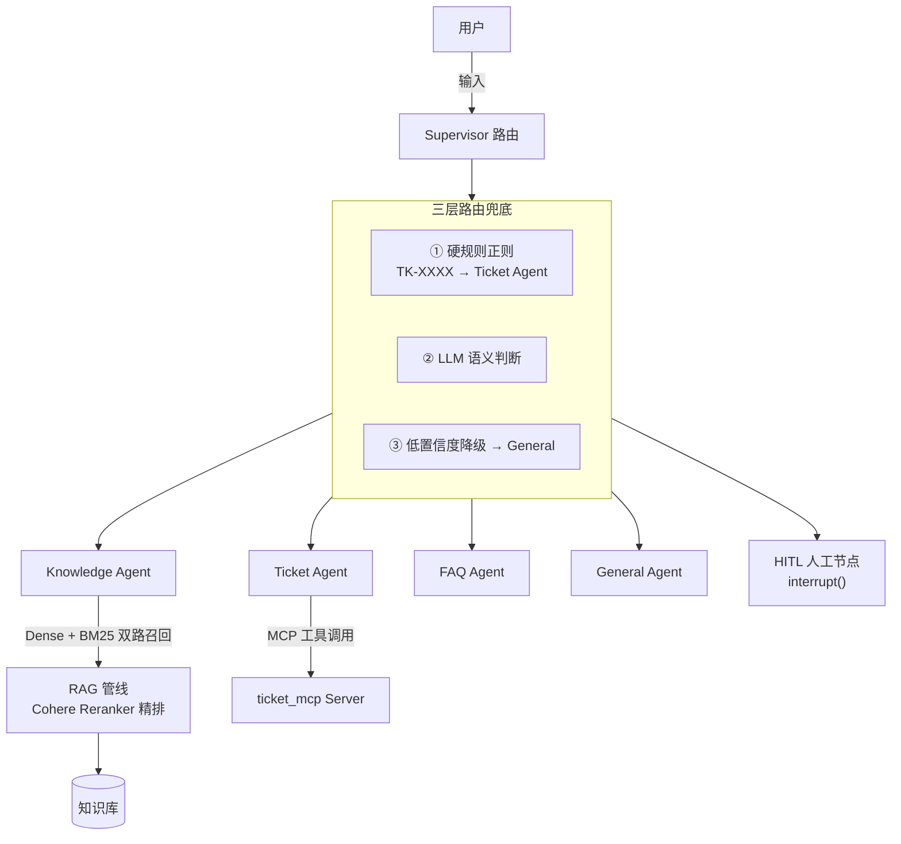

# 企业知识库 Agent 系统

基于 **LangChain + LangGraph** 构建的多 Agent 协作式企业知识库问答系统。系统以 Supervisor 路由为核心，通过知识库 RAG 检索、工单管理、FAQ 快速匹配与人工介入（Human-in-the-Loop）四条能力链路，覆盖企业客服与知识沉淀场景的完整闭环。

## ✨ 项目亮点

- **Supervisor 多 Agent 架构**：Knowledge / Ticket / FAQ / General 四类专业 Agent + HITL 人工节点，职责清晰、可独立扩展
- **三层路由兜底策略**：硬规则正则 → LLM 语义判断 → 低置信度降级，兼顾 100% 可靠性与 90% 场景覆盖率
- **双路召回 + 精排 RAG**：Dense（Chroma）+ BM25 双路召回，Cohere Reranker 精排，兼顾语义与关键词匹配
- **增量式记忆压缩**：Buffer + Summary 混合策略，长对话 Token 消耗降低 **87%**
- **标准 MCP 工具接入**：工单能力通过 MCP Server 暴露，支持跨 Agent / 跨框架复用
- **可量化评估体系**：openevals 三维评估（相关性 / 有据性 / 正确性）+ 路由准确率 + 19 项单元测试

## 🏗️ 系统架构



## 🧰 技术栈

| 层 | 技术选型 |
|----|---------|
| 检索 | LangChain BM25 + Chroma Dense + Cohere Reranker |
| 编排 | LangGraph StateGraph + Supervisor 模式 |
| 记忆 | SQLite Checkpointer + Buffer + Summary 增量压缩 |
| 工具接入 | MCP Server（ticket_mcp） |
| HITL | LangGraph `interrupt()` API |
| 评估 | openevals + pytest |
| LLM | OpenAI GPT-4o-mini |
| 后端服务 | FastAPI（迭代中，见 `backend/`） |

## 🚀 快速开始

> 环境要求：Python 3.12（`uv` 或原生 `venv` 均可）

**1. 创建虚拟环境并安装依赖**

```bash
# 方式一：uv（推荐）
uv venv
# 激活（Windows PowerShell）：.venv\Scripts\activate
# 激活（macOS / Linux）：source .venv/bin/activate
uv pip install -r requirements.txt

# 方式二：原生 venv
# Windows：py -3.12 -m venv .venv && .venv\Scripts\activate
# macOS / Linux：python3.12 -m venv .venv && source .venv/bin/activate
pip install -r requirements.txt
```

**2. 配置环境变量**

```bash
cp .env.example .env
```

编辑 `.env`：

| 变量 | 必填 | 说明 |
|------|:---:|------|
| `OPENAI_API_KEY` | ✅ | 主 LLM 的 API Key |
| `COHERE_API_KEY` | ❌ | 可选，用于 Cohere Reranker 精排 |

**3. 启动 CLI 交互**

```bash
python -m src.main
```

## 📁 项目结构

```
├── src/                      # 核心 Agent 系统
│   ├── main.py               # CLI 入口
│   ├── config.py             # 配置管理
│   ├── supervisor.py         # Supervisor 路由（多 Agent + 三层兜底）
│   ├── routing_rules.py      # 路由硬规则（独立模块，便于测试）
│   ├── memory.py             # 记忆压缩策略（Buffer + Summary）
│   ├── hitl.py               # HITL 转人工
│   ├── agents/               # 专业 Agent
│   │   ├── knowledge.py      # RAG 检索 Agent
│   │   ├── ticket.py         # 工单 Agent
│   │   └── faq.py            # FAQ Agent
│   ├── rag/
│   │   └── pipeline.py       # RAG 检索管线
│   └── tools/
│       └── ticket_mcp.py     # MCP Server
├── backend/                  # FastAPI 后端外壳（迭代中）
├── data/
│   └── knowledge_base.md     # 知识库文档
├── eval/                     # openevals 评估脚本
├── tests/                    # pytest 单元测试
├── requirements.txt
└── .env.example
```

## 📊 评估与测试

```bash
# 一键评估（检索 + 路由）
python -m eval.run_all

# 分项评估
python -m eval.run_all --rag      # RAG：相关性 / 有据性 / 正确性
python -m eval.run_all --route    # Supervisor 路由准确率

# 单元测试（三层路由兜底 + 记忆压缩）
python -m pytest tests/ -v
```

**评估维度**：`retrieval_relevance` / `groundedness` / `correctness` / `routing accuracy`

## 📈 性能数据

**记忆压缩策略对比**（10 轮对话实测，Buffer + Summary 增量混合）：

| 策略 | Token 消耗 | 节省比例 | 说明 |
|------|-----------|---------|------|
| 不压缩（全量 messages） | ~2300 | 0% | 随对话长度线性增长 |
| Token 窗口截断 | ~2000 | 13% | 保留最近 N 条 + system prompt |
| **Buffer + Summary 增量混合** | **~300** | **87%** | 保留最近 10 条原始消息 + 增量摘要 |

## 📄 License

[MIT](LICENSE)
